# <div align="center">👋 Hi there, I'm **Sanjeet Kotarya**</div>

<div align="center">
  
</div>

---

## 🎯 **About Me**

```python
class SanjeetKotarya:
    def __init__(self):
        self.education = "M.Tech in Biomedical Engineering @ IIT Madras"
        self.role = "Product Designer & VR/AR Developer"
        self.passion = ["Product Design", "Virtual Reality", "Artificial Intelligence"]
        self.current_project = "PDF-GPT Pro (Offline AI PDF Reader)"
        self.hobbies = ["3D Art", "Game Development", "Tech Innovation"]
    
    def get_daily_routine(self):
        return "☕️ Code → 🎨 Design → 🚀 Build → 🔄 Repeat"
```

---

## 🛠️ **Tech Arsenal**

<div align="center">

### **Languages & Frameworks**


### **3D & Game Development**


### **AI & Machine Learning**


### **Tools & Platforms**


</div>

---

## 🚀 **Featured Projects**

<div align="center">

| Project | Description | Tech Stack | Status |
|---------|-------------|------------|---------|
| **🧠 [PDF-GPT Pro](https://github.com/yourusername/pdf-gpt-pro)** | Offline AI-powered PDF reader with advanced analytics | `Python` `PyQt` `Transformers` | 🔥 Active |
| **📊 [VR Data Visualizer](https://github.com/yourusername/VR-Data-Visualizer)** | Immersive 3D data exploration in virtual reality | `Unity` `C#` `OpenXR` | ✅ Complete |
| **🎮 [Driving Simulator](https://github.com/yourusername/driving-simulator)** | Realistic driving training simulation | `Unity` `C#` `Physics` | 🚧 In Progress |

</div>

---

## 📊 **GitHub Analytics**

<div align="center">
  
  
</div>

<div align="center">
  
</div>

---

## 🏆 **Achievements & Highlights**

<div align="center">

```
🎓 M.Tech from IIT Madras              🚀 Building Next-Gen AI Tools
🎨 Expert in 3D Modeling & Animation   💡 Product Design Specialist
🥽 VR/AR Development Experience        📱 Cross-Platform App Developer
```

</div>

---

## 📈 **Current Focus**

```mermaid
graph LR
    A[🤖 AI/ML] --> B[📱 Product Development]
    B --> C[🥽 VR/AR Experiences]
    C --> D[🎨 3D Design]
    D --> A
    
    style A fill:#ff6b6b
    style B fill:#4ecdc4  
    style C fill:#45b7d1
    style D fill:#96ceb4
```

<div align="center">



</div>

---

## 🌐 **Connect With Me**

<div align="center">

[](https://www.linkedin.com/in/yourprofile)
[](https://instagram.com/yourprofile)
[](https://yourportfolio.com)
[](mailto:your.email@example.com)

</div>

---

<div align="center">
  
</div>

<div align="center">
  <h3>💭 "Innovation distinguishes between a leader and a follower" - Steve Jobs</h3>
</div>

---

<div align="center">
  
</div>
